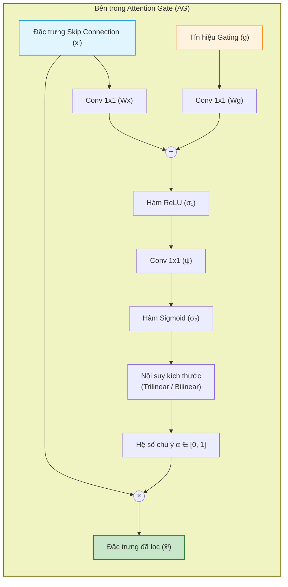
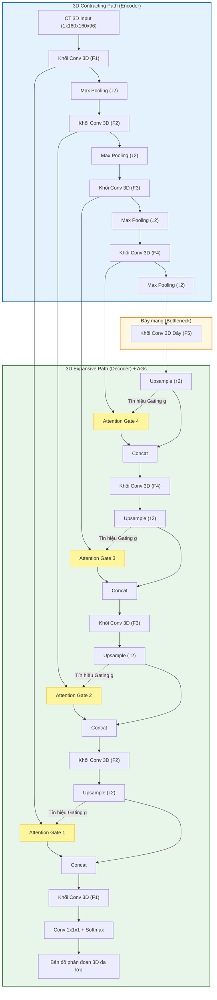

# Attention U-Net: Học Nơi Cần Nhìn Để Phân Đoạn Tuyến Tụy (Learning Where to Look for the Pancreas)

> **Tên bài báo gốc:** *Attention U-Net: Learning Where to Look for the Pancreas*  
> **Tác giả:** Ozan Oktay, Jo Schlemper, Loic Le Folgoc, Matthew Lee, Mattias Heinrich, Kazunari Misawa, Kensaku Mori, Steven McDonagh, Nils Y Hammerla, Bernhard Kainz, Ben Glocker, Daniel Rueckert  
> **Đơn vị nghiên cứu:** Imperial College London (Anh), Đại học Nagoya (Nhật Bản), Đại học Luebeck (Đức), HeartFlow, Babylon Health  
> **Năm công bố:** 2018 (Hội nghị Quốc tế MIDL - Medical Imaging with Deep Learning / arXiv:1804.03999)  
> **Mã nguồn PyTorch chính thức:** [GitHub - ozan-oktay/Attention-Gated-Networks](https://github.com/ozan-oktay/Attention-Gated-Networks)

---

## 📌 1. Tổng quan & Đặt vấn đề

### 1.1 Thách thức trong phân đoạn Tuyến Tụy (Pancreas Segmentation) trên CT
Trong chụp cắt lớp vi tính (CT) vùng bụng, **tuyến tụy (pancreas)** được mệnh danh là cơ quan "khó nhằn" bậc nhất đối với các thuật toán phân đoạn tự động:
1. **Kích thước nhỏ và tỷ lệ biến thiên cực lớn:** Tụy chiếm một thể tích rất nhỏ trong toàn bộ khoang bụng, hình dạng và kích thước thay đổi khó lường giữa các bệnh nhân khác nhau.
2. **Độ tương phản mô cực thấp (Poor Tissue Contrast):** Tụy nằm chen chúc giữa các mô mềm và cơ quan nội tạng phức tạp (tá tràng, dạ dày, mạch máu mạc treo), ranh giới giải phẫu rất mờ nhạt.

### 1.2 Hạn chế của U-Net truyền thống và Mô hình Cascaded
- **Vấn đề của U-Net gốc (Ronneberger et al., 2015):**  
  Các đường nối tắt (**Skip Connections**) trong U-Net truyền đạt **toàn bộ** bản đồ đặc trưng từ tầng Encoder sang Decoder. Điều này vô tình đưa cả các thông tin không liên quan, nhiễu nền và các cơ quan xung quanh vào Decoder, dẫn đến việc mô hình dự đoán dương tính giả (**False Positives**) rất nhiều ở những cơ quan nhỏ và khó như tụy.
- **Nhược điểm của các giải pháp chuỗi 2 giai đoạn (Cascaded Multi-stage CNNs):**  
  Trước bài báo này, giải pháp phổ biến là dùng 2 mạng riêng biệt:
  - *Mạng 1:* Định vị sơ bộ vùng quan tâm (ROI Bounding Box).
  - *Mạng 2:* Cắt vùng ROI đó và phân đoạn chi tiết.
  - ❌ **Hạn chế:** Tốn tài nguyên tính toán gấp đôi (cả hai mạng đều phải học lại các bộ trích xuất đặc trưng bậc thấp tương tự nhau), đường ống xử lý cồng kềnh, nếu mạng 1 cắt lệch thì mạng 2 sẽ hoàn toàn sai.

### 1.3 Ý tưởng đột phá của Attention U-Net
Nhóm tác giả đề xuất **Cổng chú ý (Attention Gates - AGs)** tích hợp thẳng vào các đường Skip Connections của U-Net:
- **Tập trung tự động (Implicit on-the-fly Focus):** Mạng tự học cách làm nổi bật (highlight) các vùng cấu trúc mục tiêu và dập tắt (suppress) các vùng nền vô nghĩa trước khi nối kênh vào Decoder.
- **Loại bỏ hoàn toàn mô hình định vị ROI riêng biệt:** Thực hiện phân đoạn chính xác chỉ bằng **một mạng duy nhất (single-stage)**, huấn luyện End-to-End từ đầu.
- **Chi phí bổ sung cực thấp:** Chỉ tăng thêm ~8% số lượng tham số và tăng chưa tới 0.012 giây thời gian suy luận trên thể tích CT 3D.

---

## 🏗️ 2. Kiến trúc Attention Gate (AG) chi tiết

### 2.1 Cơ chế hoạt động của Attention Gate (AG)
Attention Gate được đặt tại mỗi đường nối tắt (Skip Connection) nối giữa Encoder và Decoder. Để quyết định "cần nhìn vào đâu", AG kết hợp 2 nguồn thông tin:
1. **Tín hiệu đặc trưng đầu vào ($x^l$):** Bản đồ đặc trưng trích xuất từ tầng $l$ của Encoder. Tín hiệu này có độ phân giải không gian cao, đường biên rõ nét nhưng bị nhiễu nền nhiều.
2. **Tín hiệu điều khiển ($g$ - Gating Signal):** Bản đồ đặc trưng lấy từ tầng sâu hơn (coarser scale) ở Decoder. Tín hiệu này có độ phân giải thấp hơn nhưng mang thông tin ngữ cảnh ngữ nghĩa phong phú (xác định được đại thể vị trí cơ quan mục tiêu).

### 2.2 Công thức Toán học của Additive Attention Gate

Attention Gate sử dụng cơ chế **Chú ý cộng (Additive Attention)** thay vì chú ý nhân (Multiplicative Attention), vì thực nghiệm chứng minh chú ý cộng cho độ chính xác cao hơn trong xử lý không gian.

Các bước tính toán cụ thể:
1. **Chiếu đặc trưng qua tích chập $1 \times 1 \times 1$:**
   $$W_x^T x_i^l \in \mathbb{R}^{F_{int}}, \quad W_g^T g_i \in \mathbb{R}^{F_{int}}$$
   *(Đưa cả hai tín hiệu về không gian biểu diễn trung gian $F_{int}$, thường chọn $F_{int} = F_l / 2$ để giảm khối lượng tính toán).*

2. **Cộng tuyến tính và kích hoạt phi tuyến:**
   $$q_{att}^l = \psi^T \left( \sigma_1(W_x^T x_i^l + W_g^T g_i + b_g) \right) + b_\psi$$
   - $\sigma_1$: Hàm kích hoạt **ReLU**.
   - $\psi$: Bộ biến đổi tuyến tính $1 \times 1 \times 1$ nén số kênh từ $F_{int}$ về $1$ kênh chú ý không gian.

3. **Tính hệ số chú ý qua Sigmoid ($\sigma_2$):**
   $$\alpha_i^l = \sigma_2(q_{att}^l) = \frac{1}{1 + \exp(-q_{att}^l)}$$
   - $\alpha_i^l \in [0, 1]$: Mỗi vị trí pixel/voxel $i$ sẽ nhận một trọng số từ 0 (hoàn toàn bỏ qua) đến 1 (tối quan trọng).
   - Tác giả chọn **Sigmoid** thay vì Softmax vì Softmax làm phân phối chú ý quá thưa (sparse), trong khi phân đoạn ngữ nghĩa cần giữ lại cả một vùng không gian liên tục của cơ quan.

4. **Nội suy và nhân lọc đặc trưng:**
   $$\hat{x}_{i,c}^l = x_{i,c}^l \cdot \alpha_i^l$$
   Bản đồ hệ số chú ý $\alpha$ được nội suy kích thước bằng Trilinear Interpolation (cho ảnh 3D) sao cho khớp với kích thước của $x^l$, sau đó nhân từng phần tử (element-wise multiplication) với $x^l$.

---

## 🏛️ 3. Kiến trúc Tổng thể Attention U-Net

Mô hình kết hợp các Attention Gates vào kiến trúc U-Net 3D hoàn chỉnh:

### 2 điểm kỹ thuật đặc biệt quan trọng:
1. **Lọc Gradient trong quá trình Lan truyền ngược (Backward Pass):**
   Trong quá trình backpropagation, đạo hàm của hàm mất mát truyền qua các tầng nông hơn được cân đo bởi hệ số chú ý:
   $$\frac{\partial \hat{x}_i^l}{\partial \Phi^{l-1}} = \alpha_i^l \frac{\partial f(x_i^{l-1}; \Phi^{l-1})}{\partial \Phi^{l-1}} + \frac{\partial \alpha_i^l}{\partial \Phi^{l-1}} x_i^l$$
   Tại những vùng nền không quan trọng, $\alpha_i^l \approx 0 \implies$ gradient từ vùng nền bị triệt tiêu gần như hoàn toàn. Nhờ vậy, **các tầng nông của Encoder chỉ được cập nhật trọng số dựa trên các đặc trưng hữu ích của cơ quan đích**, tránh bị phân tán bởi nhiễu ngoại cảnh.

2. **Giám sát sâu (Deep Supervision):**
   Mô hình đặt thêm các đầu ra phụ (auxiliary segmentation heads) tại các tầng phân giải trung gian của Decoder. Việc này ép các tầng trung gian phải có tính phân biệt ngữ nghĩa cao (semantically discriminative), giúp tín hiệu gating $g$ dẫn dắt các khối AG hiệu quả hơn.

---

## 📊 4. Kết quả Thực nghiệm & Đánh giá

Nhóm tác giả đánh giá mô hình trên hai bộ dữ liệu chụp cắt lớp vi tính bụng lớn:
1. **CT-150:** Gồm 150 ca chụp 3D CT ổ bụng (phân đoạn Tụy, Lá lách, Thận).
2. **NIH-TCIA Pancreas-CT (CT-82):** 82 ca chụp CT có tăng quang, tiêu chuẩn đánh giá kinh điển cho phân đoạn tuyến tụy.

### 4.1 Kết quả trên tập dữ liệu CT-150 (So sánh với U-Net chuẩn)

| Mô hình & Cấu hình | DSC Tụy (%) (Càng cao càng tốt) | Recall Tụy (%) | Surface-to-Surface (mm) (Càng thấp càng tốt) | Tổng số tham số | Thời gian suy luận (3D) |
| :--- | :---: | :---: | :---: | :---: | :---: |
| **U-Net 3D chuẩn** (120 ảnh train) | 81.4 ± 11.6 | 80.6 ± 12.6 | 2.358 ± 1.464 | **5.88 M** | **0.167 s** |
| **Attention U-Net** (120 ảnh train) | **84.0 ± 8.7** | **84.1 ± 9.2** | **1.920 ± 1.284** | **6.40 M** | **0.179 s** |
| *U-Net 3D chuẩn (Chỉ 30 ảnh train)* | 74.1 ± 13.7 | 74.3 ± 17.9 | 3.765 ± 3.452 | 5.88 M | 0.167 s |
| *Attention U-Net (Chỉ 30 ảnh train)* | **76.7 ± 13.2** | **76.2 ± 14.5** | **3.507 ± 3.814** | 6.40 M | 0.179 s |

> **Nhận xét quan trọng:**
> - Điểm **Dice của Tụy tăng thêm 2.6%**, khoảng cách sai số bề mặt (S2S) giảm đáng kể từ 2.36 mm xuống **1.92 mm**.
> - Chỉ số **Recall tăng vọt** ($80.6\% \rightarrow 84.1\%$), chứng minh Attention Gates giúp mạng hạn chế tối đa việc bỏ sót các vùng viền của tụy.
> - Khi huấn luyện với số lượng mẫu ít (chỉ 30 ảnh), Attention U-Net vẫn vượt trội U-Net chuẩn tới 2.6% DSC.

### 4.2 Thử nghiệm bóc tách (Ablation Study): Tăng dung lượng mạng hay dùng Attention Gate?
Để chứng minh kết quả tăng không phải do mô hình có thêm 8% tham số, tác giả so sánh Attention U-Net với U-Net thường được tăng dung lượng (nhiều bộ lọc hơn):

| Mô hình | Dung lượng (# Params) | Dice Tụy (DSC) | Khoảng cách S2S |
| :--- | :---: | :---: | :---: |
| U-Net mở rộng 1 | 6.44 M | 82.1% | 2.383 mm |
| U-Net mở rộng 2 (rất lớn) | 10.40 M | 82.5% | 2.202 mm |
| **Attention U-Net** | **6.40 M** | **84.0%** | **1.920 mm** |

👉 **Kết luận:** Tăng số lượng tham số đơn thuần chỉ tăng nhẹ hiệu năng, trong khi cơ chế **Attention Gate mang lại bước nhảy vọt thực chất về mặt cấu trúc giải thuật**.

### 4.3 So sánh với các phương pháp State-of-the-Art trên benchmark TCIA CT-82
- Trên benchmark quốc tế NIH-TCIA, Attention U-Net đạt **83.1% DSC** (sau khi tinh chỉnh) và **81.48 ± 6.23% DSC** qua kiểm chứng chéo 5-fold.
- Thành tích này ngang ngửa và vượt qua các hệ thống **Cascaded Multi-Model FCN 2 giai đoạn** phức tạp của Roth et al. hay Zhou et al., trong khi Attention U-Net chỉ cần đúng **1 mô hình duy nhất chạy end-to-end**.

---

## ⚖️ 5. So sánh: Vanilla U-Net vs. Attention U-Net

| Tiêu chí | U-Net Truyền Thống (2015) | Attention U-Net (2018) |
| :--- | :--- | :--- |
| **Skip Connection** | Nối thẳng 100% bản đồ đặc trưng từ Encoder sang Decoder | Lọc qua Attention Gate trước khi nối; chỉ giữ vùng mục tiêu |
| **Độ nhạy với nhiễu nền** | Dễ bị nhiễu do vùng nền kích hoạt mạnh | Triệt tiêu phản ứng ở các vùng mô không liên quan |
| **Xử lý cơ quan nhỏ & biến thiên** | Kém; thường cần thêm mô hình crop ROI hỗ trợ | Rất tốt; tự học vùng cần chú ý mà không cần crop ROI |
| **Cập nhật Gradient (Backprop)** | Cập nhật đồng đều toàn bộ ảnh, kể cả vùng nền | Gradient vùng nền bị dập tắt, tập trung tối ưu hóa vật thể |
| **Khối lượng tính toán** | Nhẹ | Chỉ thêm ~8% tham số, thời gian inference gần như tương đương |

---

## 🌟 6. Tầm ảnh hưởng & Ứng dụng hiện đại

1. **Chuẩn mực trong phân đoạn nội tạng & tổn thương nhỏ:**  
   Sau khi ra đời, Attention U-Net nhanh chóng trở thành kiến trúc nền tảng cho các bài toán phân đoạn polyp đại tràng, u não (BraTS), u gan, nang thận và tổn thương phổi COVID-19.
2. **Cầu nối giữa CNN cổ điển và Vision Transformer:**  
   Trước khi Transformer và Self-Attention bùng nổ trong Computer Vision (2020-nay), Attention Gate là minh chứng kinh điển cho việc tích hợp cơ chế chú ý định hướng không gian một cách thanh lịch và tiết kiệm tài nguyên vào mạng tích chập.
3. **Mô-đun cắm ghép vạn năng (Plug-and-Play):**  
   Khối Attention Gate hoàn toàn độc lập với tác vụ; có thể dễ dàng gắn vào bất kỳ biến thể U-Net nào (Res-UNet, Dense-UNet, 3D U-Net) hoặc dùng cho bài toán phân loại và hồi quy ảnh.

---

## 📋 7. Tóm tắt nhanh (Key Takeaways)

| Thuật ngữ | Ý nghĩa cốt lõi |
| :--- | :--- |
| **Vấn đề cốt lõi** | Tụy rất nhỏ, viền mờ, U-Net thường hay dự đoán dương tính giả do Skip Connection mang theo nhiều nhiễu nền. |
| **Attention Gate (AG)** | Khối lọc mềm tích hợp trên skip connection, dùng tín hiệu cấp cao từ Decoder để điều khiển và dập nhiễu đặc trưng cấp thấp từ Encoder. |
| **Additive Attention** | Dùng phép cộng tuyến tính ($1\times1\times1$ Conv) kết hợp ReLU và Sigmoid để tính ma trận chú ý $\alpha \in [0, 1]$. |
| **Single-Stage** | Huấn luyện đầu-cuối trong một mạng duy nhất, loại bỏ sự cần thiết của hệ thống 2 mạng (định vị thô + phân đoạn tinh). |
| **Hiệu năng thực nghiệm** | Đạt **84.0% DSC** trên CT-150 (+2.6% so với U-Net), giảm 18% sai số bề mặt (S2S), chỉ tốn thêm 8% tham số. |
