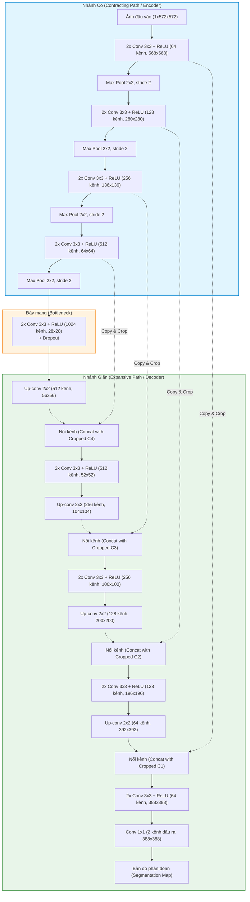

# U-Net: Mạng Nơ-ron Tích chập Phân đoạn Ảnh Y sinh (Biomedical Image Segmentation)

> **Tên bài báo gốc:** *U-Net: Convolutional Networks for Biomedical Image Segmentation*  
> **Tác giả:** Olaf Ronneberger, Philipp Fischer, Thomas Brox (Đại học Freiburg, Đức)  
> **Năm công bố:** 2015 (MICCAI / arXiv:1505.04597)  
> **Mã nguồn gốc & Mô hình đã huấn luyện:** [LMB Freiburg U-Net](http://lmb.informatik.uni-freiburg.de/people/ronneber/u-net)

---

## 📌 1. Tổng quan & Đặt vấn đề

### 1.1 Bối cảnh ra đời
Vào những năm 2012 - 2015, mạng nơ-ron tích chập sâu (Deep CNNs) như AlexNet, VGG đã tạo ra bước đột phá vượt bậc trong thị giác máy tính, nhưng chủ yếu tập trung vào bài toán **phân loại ảnh (image classification)** — gán một nhãn duy nhất cho toàn bộ bức ảnh dựa trên tập dữ liệu khổng lồ (ví dụ ImageNet với hơn 1 triệu ảnh).

Tuy nhiên, trong xử lý **ảnh y sinh (Biomedical Image Processing)**, chúng ta đối mặt với hai thách thức cốt tử:
1. **Yêu cầu phân đoạn mức độ từng điểm ảnh (Pixel-wise Segmentation / Localization):** Không chỉ trả lời câu hỏi *"Ảnh này có tế bào/khối u không?"*, mà phải chỉ rõ *"Từng điểm ảnh nào thuộc tế bào, ranh giới tế bào ở đâu?"*.
2. **Sự khan hiếm dữ liệu gán nhãn:** Việc gán nhãn từng pixel trên ảnh y tế (như ảnh vi thể, MRI, CT) đòi hỏi chuyên gia y tế thao tác thủ công, vô cùng tốn thời gian và chi phí. Bộ dữ liệu huấn luyện thường chỉ có vài chục tấm ảnh (ví dụ ISBI EM chỉ có đúng **30 ảnh**).

### 1.2 Hạn chế của giải pháp trước đó (Sliding-window của Ciresan et al. 2012)
Trước U-Net, phương pháp tốt nhất là trượt một cửa sổ (patch) qua từng pixel để dự đoán nhãn của pixel trung tâm:
- ❌ **Rất chậm và lãng phí tính toán:** Cửa sổ trượt phải chạy độc lập cho từng patch, các patch chồng lấn nhau gây ra sự trùng lặp tính toán khổng lồ.
- ❌ **Đánh đổi giữa bối cảnh và độ chính xác vị trí (Context vs. Localization Trade-off):** 
  - Muốn hiểu ngữ cảnh lớn (context) -> patch phải lớn -> cần nhiều lớp Max-Pooling -> giảm độ phân giải không gian, làm mất ranh giới chi tiết.
  - Muốn vị trí chính xác -> patch phải nhỏ -> mô hình chỉ nhìn thấy một vùng hẹp và "mù" ngữ cảnh tổng thể.

### 1.3 Đột phá của U-Net
U-Net kế thừa ý tưởng mạng tích chập toàn phần (**Fully Convolutional Network - FCN**) của Long et al. (2014) và cải tiến mạnh mẽ:
- Hoạt động theo cơ chế **End-to-End** (ảnh vào $\rightarrow$ mặt nạ phân đoạn ra trong một lượt truyền).
- Cần **rất ít dữ liệu huấn luyện** nhờ kỹ thuật tăng cường dữ liệu biến dạng đàn hồi (**elastic deformation**).
- Tạo ra bản đồ phân đoạn có độ chính xác cao cả về ngữ cảnh lẫn đường biên tế bào nhờ kiến trúc đối xứng chữ **U** với các **Skip Connections**.
- **Tốc độ cực nhanh:** Phân đoạn ảnh $512 \times 512$ trong chưa đầy 1 giây trên GPU.

---

## 🏗️ 2. Kiến trúc mạng U-Net chi tiết

Kiến trúc U-Net có dạng hình chữ **U** đối xứng hoàn chỉnh, gồm 2 nhánh chính kết nối với nhau:
1. **Nhánh co (Contracting / Encoder Path - bên trái):** Trích xuất đặc trưng và nắm bắt ngữ cảnh ngữ nghĩa (Context).
2. **Nhánh giãn (Expansive / Decoder Path - bên phải):** Khôi phục độ phân giải không gian và định vị chính xác vị trí (Localization).
3. **Đường nối tắt (Skip Connections):** Chuyển trực tiếp các bản đồ đặc trưng độ phân giải cao từ Encoder sang Decoder.

### 2.1 Nhánh Co (Contracting Path)
- Bao gồm các khối lặp lại: mỗi khối gồm **hai lớp tích chập $3 \times 3$ (unpadded convolutions)**, tiếp sau bởi hàm kích hoạt **ReLU**.
- Sau mỗi khối là một lớp **Max Pooling $2 \times 2$, stride 2** để giảm độ phân giải xuống một nửa.
- Cứ sau mỗi lần downsampling, số lượng kênh đặc trưng (feature channels) lại **nhân đôi** ($64 \rightarrow 128 \rightarrow 256 \rightarrow 512 \rightarrow 1024$).

### 2.2 Nhánh Giãn (Expansive Path)
- Mỗi bước mở rộng bao gồm một phép **Up-convolution $2 \times 2$ (Tích chập chuyển vị / Transposed Convolution)** giúp tăng gấp đôi kích thước không gian và giảm một nửa số kênh.
- **Skip Connection (Nối kênh):** Bản đồ đặc trưng sau up-conv được nối (concatenate) với bản đồ đặc trưng tương ứng từ nhánh Encoder.
- Tiếp theo là **hai lớp tích chập $3 \times 3$ kèm ReLU** để học cách tổng hợp thông tin ngữ cảnh và vị trí chi tiết.
- **Lớp cuối cùng:** Sử dụng tích chập **$1 \times 1$** biến đổi 64 kênh thành số lớp mục tiêu (ví dụ 2 lớp: background và tế bào/vật thể).
- **Tổng cộng:** Mô hình có **23 lớp tích chập** (không có bất kỳ lớp Fully Connected nào).

### 2.3 Vì sao cần phép "Copy and Crop" trong Skip Connections?
Trong bài báo gốc, tác giả dùng **Unpadded Convolutions** (valid padding, không đệm số 0 ở viền) để đảm bảo mọi pixel tính toán đều có bối cảnh thực. Điều này khiến kích thước đặc trưng giảm dần sau mỗi lớp tích chập:
- Ảnh đầu vào: $572 \times 572$
- Đặc trưng tầng 1 nhánh Encoder: $568 \times 568$
- Khi nhánh Decoder upsample trở lại cùng cấp: kích thước là $392 \times 392$.
- Do đó, cần **cắt xén (crop)** phần viền dư của bản đồ đặc trưng từ Encoder trước khi ghép nối vào Decoder.

*(Ghi chú: Trong các triển khai hiện đại bằng PyTorch/TensorFlow, người ta thường dùng `padding='same'` để giữ nguyên kích thước không gian, tránh việc phải cắt xén).*

---

## 💡 3. Các kỹ thuật & cải tiến cốt lõi trong huấn luyện

### 3.1 Chiến lược "Overlap-Tile" xử lý ảnh kích thước vô hạn
Trong y tế, ảnh hiển vi có độ phân giải siêu cao (ví dụ hàng nghìn pixel), không thể nhét vừa bộ nhớ VRAM của GPU.
- U-Net giải quyết bằng cách chia ảnh lớn thành các **mảnh gạch (tiles)** xếp chồng lấn.
- Để dự đoán vùng trung tâm (vùng màu vàng), mô hình nhận đầu vào là vùng rộng hơn (vùng màu xanh).
- Ở các cạnh ngoài cùng của bức ảnh, phần bối cảnh bị thiếu được xử lý thông minh bằng cách **lấy đối xứng gương (mirroring extrapolation)** thay vì chèn 0 (zero padding), giúp đường biên ảnh tự nhiên và chính xác.

### 3.2 Tăng cường dữ liệu bằng biến dạng đàn hồi (Elastic Deformation)
Vì bộ dữ liệu y sinh cực kỳ ít (chỉ vài chục ảnh), tăng cường dữ liệu (Data Augmentation) là chìa khóa sống còn:
- Ngoài các phép biến đổi thông thường (xoay, dịch chuyển, lật, thay đổi độ sáng xám), tác giả giới thiệu **Elastic Deformation ngẫu nhiên**.
- Cơ chế: Tạo lưới thưa $3 \times 3$ với vector độ dời ngẫu nhiên phân phối chuẩn ($\sigma = 10\text{ px}$), sau đó nội suy song bậc ba (bicubic interpolation) cho từng pixel.
- **Ý nghĩa sinh học:** Các mô tế bào sinh học trong thực tế có tính đàn hồi tự nhiên và dễ bị co giãn, biến dạng hình thể. Việc mô phỏng biến dạng đàn hồi giúp mạng học được tính bất biến hình dạng mà không cần thu thập hàng chục ngàn mẫu thật.

### 3.3 Hàm mất mát có trọng số phân tách tế bào chạm nhau (Separation Loss Weight)
Một vấn đề nan giải trong phân đoạn tế bào là các tế bào nằm **sát cạnh hoặc dính liền nhau (touching cells)**, khiến mô hình dễ gộp chúng thành một cụm lớn.

Tác giả thiết kế một bản đồ trọng số điểm ảnh $w(x)$ được tính toán trước qua phép toán hình thái học (morphological operations):

$$E = \sum_{x \in \Omega} w(x) \log\left(p_{\ell(x)}(x)\right)$$

Trong đó bản đồ trọng số tại điểm ảnh $x$ được tính theo công thức:

$$w(x) = w_c(x) + w_0 \cdot \exp\left( -\frac{(d_1(x) + d_2(x))^2}{2\sigma^2} \right)$$

**Giải thích các thành phần:**
- $w_c(x)$: Trọng số cân bằng tần suất xuất hiện của các lớp (chống mất cân bằng giữa nền và vật thể).
- $d_1(x)$: Khoảng cách từ pixel $x$ đến ranh giới của tế bào gần nhất.
- $d_2(x)$: Khoảng cách từ pixel $x$ đến ranh giới của tế bào gần thứ nhì.
- $w_0 = 10$ và $\sigma \approx 5\text{ pixels}$.

> **Ý nghĩa thực tế:** Khi một pixel nằm ngay giữa ranh giới khe hẹp của 2 tế bào chạm nhau, khoảng cách $d_1(x) + d_2(x)$ rất nhỏ $\rightarrow$ số hạng mũ tiệm cận 1 $\rightarrow$ trọng số lỗi $w(x)$ tại khe hẹp tăng vọt! Nếu mô hình phân đoạn dính 2 tế bào vào nhau, nó sẽ bị phạt cực kỳ nặng. Nhờ đó, U-Net tách rời các tế bào riêng lẻ một cách chuẩn xác.

### 3.4 Khởi tạo trọng số He (He Initialization)
Vì mạng sâu và có nhiều nhánh rẽ, việc khởi tạo trọng số ngẫu nhiên rất dễ gây bão hòa hoặc triệt tiêu gradient. Nhóm tác giả sử dụng phân phối chuẩn Gauss với độ lệch chuẩn:
$$\text{std} = \sqrt{\frac{2}{N}}$$
(với $N$ là số kết nối đầu vào của một nơ-ron, ví dụ tích chập $3 \times 3$ với 64 kênh thì $N = 3 \times 3 \times 64 = 576$).

---

## 📊 4. Kết quả thực nghiệm xuất sắc

U-Net đã tham gia và chiến thắng áp đảo tại các cuộc thi phân đoạn y tế danh giá:

### 4.1 Thử thách EM Segmentation (ISBI 2012)
Phân đoạn màng và cấu trúc nơ-ron từ chuỗi ảnh hiển vi điện tử (EM) của ấu trùng ruồi giấm (*Drosophila*). Tập huấn luyện chỉ có **30 ảnh ($512 \times 512$)**.

| Hạng | Phương pháp / Nhóm | Warping Error (càng thấp càng tốt) | Rand Error | Pixel Error |
| :---: | :--- | :---: | :---: | :---: |
| - | *Mức người gán nhãn thủ công* | *0.000005* | *0.0021* | *0.0010* |
| 🥇 **1** | **U-Net** | **0.000353** | **0.0382** | **0.0611** |
| 2 | DIVE-SCI | 0.000355 | 0.0305 | 0.0584 |
| 3 | IDSIA (Ciresan et al. - Đương kim vô địch) | 0.000420 | 0.0504 | 0.0613 |

> U-Net thiết lập kỷ lục mới về Warping Error mà không cần bất kỳ bước tiền xử lý hay hậu xử lý phức tạp nào.

### 4.2 Thử thách Cell Tracking Challenge (ISBI 2015)
- **Tập dữ liệu "PhC-U373"** (Tế bào u nguyên bào đệm trên kính hiển vi tương phản pha, chỉ 35 ảnh huấn luyện):
  - U-Net đạt **IOU (Intersection over Union) = 92.03%** (thuật toán đứng nhì chỉ đạt **83%**).
- **Tập dữ liệu "DIC-HeLa"** (Tế bào ung thư cổ tử cung HeLa trên kính hiển vi DIC, chỉ 20 ảnh huấn luyện):
  - U-Net đạt **IOU = 77.56%** (thuật toán đứng nhì chỉ đạt vỏn vẹn **46%**).

### 4.3 Tốc độ & Hiệu năng
- Thời gian huấn luyện: Chỉ mất khoảng **10 giờ** trên 1 card đồ họa NVIDIA Titan 6GB (năm 2015).
- Tốc độ suy luận: Dưới **1 giây** cho một ảnh $512 \times 512$.

---

## ⚖️ 5. Đánh giá ưu điểm & Hạn chế

### Ưu điểm
1. **Hiệu quả cao với tập dữ liệu nhỏ:** Khả năng huấn luyện tốt chỉ với vài chục bức ảnh mẫu.
2. **Bảo toàn thông tin đa tầng:** Skip connection chuyển giao chi tiết không gian độ phân giải cao trực tiếp tới decoder, khắc phục hoàn toàn nhược điểm mất chi tiết do pooling.
3. **Phân đoạn mượt mà ảnh lớn:** Cơ chế Overlap-tile cho phép xử lý ảnh kích thước tùy ý bất chấp giới hạn VRAM.
4. **Tách biên đối tượng tiếp xúc cực tốt:** Nhờ hàm mất mát có trọng số biên (Weighted Loss).

### Hạn chế & Hướng cải tiến sau này
- Phiên bản gốc dùng valid padding làm giảm kích thước ảnh đầu ra so với đầu vào (được khắc phục trong các phiên bản sau bằng `same` padding).
- Kiến trúc 2D thuần túy: Chưa khai thác mối liên kết chiều thứ 3 trong các khối ảnh cắt lớp thể tích 3D (dẫn đến sự ra đời của **3D U-Net** năm 2016).
- Chưa có cơ chế chú ý (attention): Các kênh đặc trưng được truyền qua skip connection một cách thụ động (dẫn đến sự ra đời của **Attention U-Net** năm 2018).

---

## 🌟 6. Tầm ảnh hưởng và Di sản khoa học

U-Net là một trong những công trình có trích dẫn khoa học cao nhất lịch sử Computer Vision (>80.000 lượt trích dẫn):
1. **Tiêu chuẩn vàng (De-facto standard) trong Y sinh:** Là nền tảng cơ sở cho hầu hết các giải pháp phân đoạn khối u, mạch máu, cơ quan nội tạng trên CT, MRI, X-ray.
2. **Họ kiến trúc mở rộng:**
   - **3D U-Net / V-Net:** Xử lý dữ liệu thể tích y tế 3 chiều.
   - **Attention U-Net:** Tích hợp Attention Gates lọc bớt nhiễu nền khi truyền qua skip connection.
   - **nnU-Net:** Khung tự động tinh chỉnh cấu hình U-Net cho mọi bài toán y sinh không cần can thiệp tay.
   - **TransUNet / Swin-UNet:** Kết hợp Vision Transformer với U-Net để nắm bắt phụ thuộc khoảng cách xa.
3. **Trụ cột của AI Tạo sinh (Generative AI):**
   - Đáng chú ý, kiến trúc khử nhiễu (Denoising network) trong các mô hình **Diffusion Models** (như **Stable Diffusion**, DDPM) chính là biến thể của U-Net!

---

## 📋 7. Tóm tắt nhanh (Key Takeaways)

| Tiêu chí | Mô tả ngắn gọn |
| :--- | :--- |
| **Kiến trúc cốt lõi** | Đối xứng hình chữ U gồm Encoder (thu nhỏ, học context) và Decoder (phóng to, định vị) |
| **Bí quyết tái tạo biên** | Skip Connection (nối kênh đặc trưng từ Encoder sang Decoder) |
| **Bí quyết huấn luyện ít dữ liệu** | Tăng cường dữ liệu bằng biến dạng đàn hồi ngẫu nhiên (Elastic Deformation) |
| **Bí quyết tách tế bào dính nhau** | Hàm mất mát Cross-Entropy có bản đồ trọng số tăng mạnh ở khoảng cách giữa 2 tế bào gần nhất |
| **Bí quyết xử lý ảnh siêu lớn** | Chiến lược Overlap-tile kết hợp gương phản chiếu biên (Mirroring) |
| **Số lớp tích chập** | 23 lớp tích chập, không có lớp Fully Connected |
